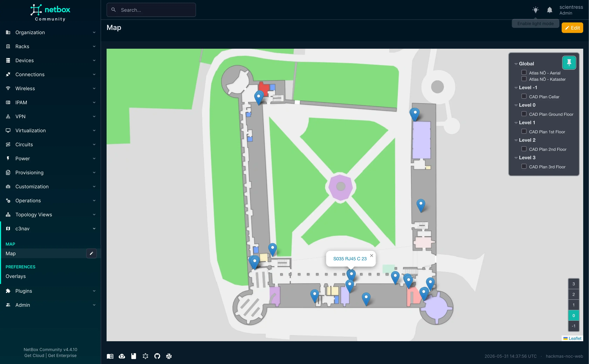
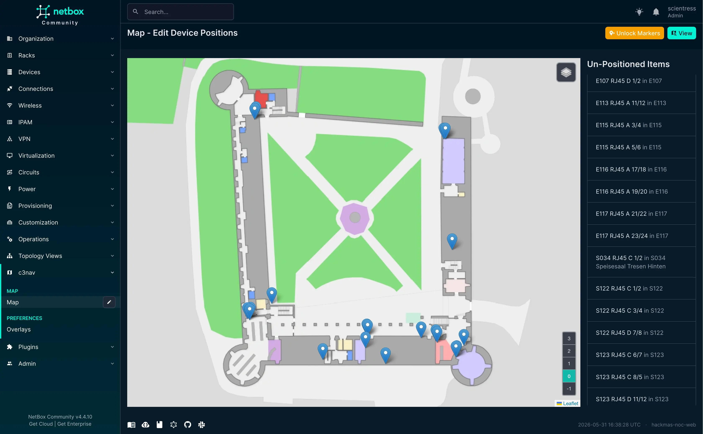
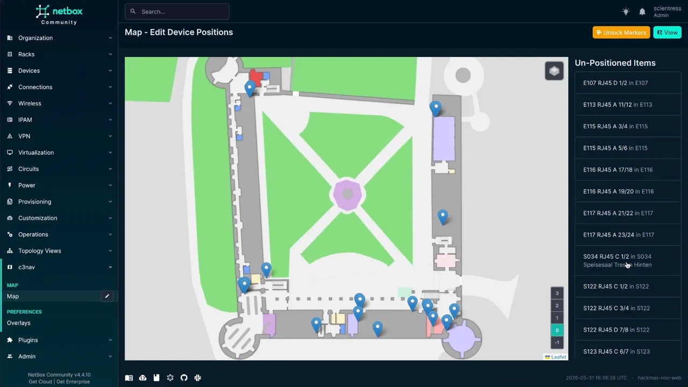

# NetBox c3nav Floor Plans

NetBox plugin for placing devices on a c3nav map.


* Free software: Apache-2.0
* Documentation: https://codeberg.org/scientress/netbox-c3nav


## Features

### Implemented

- Place devices on map backed by c3nav through the NetBox UI
- Add overlays to the map, i.e. building CAD plans
  - Via images uploaded to netbox
  - Via an external url to an image or XYZ tiles in the same CRS as the c3nav instance
- Navigate to a device's position in c3nav from the device detail view
- REST API endpoints for programmatic access
- Integration with NetBox's permission system
- Proxying of c3nav tiles with insertion of the tile_access_token

### In Development

- Per device-role icons
- Navigate to a devices position in map view from device's detail view
- Support for c3nav instances protected by basic auth or oauth2-proxy
- Semi-Automatic one way synchronization of overlays from c3nav to netbox-c3nav
- Full change logging and journaling support (WIP)

### Planed

- Dashboard widget
- Mini Map in the device detail page
- Automatic population of a devices coordinates if the c3nav instance is geo-referenced 
- Interactive status display for Aruba (HPE) Access Points
- Automatic placement of Aruba (HPE) Access Points that have a good GPS lock
- Visualization of logical connections and cables
- Automatic synchronization of access point positions with c3nav
- The option to automatically tile image overlays to XYZ tiles for faster overlay loading

## Screenshots

### Map View



### Map Edit View



### Place devices with drag and drop



## Compatibility

This plugin requires **NetBox 4.4** or later.

| NetBox Version | Plugin Version |
|----------------|----------------|
|     4.4+       |      0.1.0     |

For more detailed compatibility information, see [COMPATIBILITY.md](COMPATIBILITY.md).

## Dependencies

This plugin requires:
- NetBox 4.4.0 or later (NetBox 4.4+)
- Python 3.13 or later

No additional Python packages are required beyond NetBox's core dependencies.

## REST API

This plugin provides REST API endpoints for managing device positions and overlays:

- `/api/plugins/c3nav/positions/` - List, create and update device positions 
- `/api/plugins/c3nav/overlays/` - List, create and update map overlays


## Installing

For adding to a NetBox Docker setup see
[the general instructions for using netbox-docker with plugins](https://github.com/netbox-community/netbox-docker/wiki/Using-Netbox-Plugins).

While this is still in development and not yet on pypi you can install with pip:

```bash
pip install git+https://codeberg.org/scientress/netbox-c3nav
```

or by adding to your `local_requirements.txt` or `plugin_requirements.txt` (netbox-docker):

```bash
git+https://codeberg.org/scientress/netbox-c3nav
```

Enable the plugin in `/opt/netbox/netbox/netbox/configuration.py`,
 or if you use netbox-docker, your `/configuration/plugins.py` file :

```python
PLUGINS = [
    'netbox_c3nav'
]

PLUGINS_CONFIG = {
    'netbox_c3nav': {
        'c3nav_url': 'https://your.c3nav.instance'
    },
}
```

## Configuration

This plugin requires a c3nav instance and at least the c3nav_url configuration option to be added to `PLUGINS_CONFIG` in your NetBox configuration file.

Other configuration options:

```python
PLUGINS_CONFIG = {
    'netbox_c3nav': {
        # c3nav instance base url
        'c3nav_url': 'https://your.c3nav.instance',
        # override the tile url returned by the api, can be left empty in almost every case
        'tileserver_url': 'https://tiles.your.c3nav.instance',
        # can be used to access non-public data
        'api_key': 'secret:something',
        # can be used to override the api-key used by the fronted, i.e. use a 2nd api key for the frontend
        'frontend_api_key': 'secret:something',
        # proxy tiles server side and insert the tile_access_token which is fetched every 30sec with the api_token
        'proxy_tiles': False,
    }
}
```

## Usage

Documentation is WIP

## Contributing

Contributions are welcome, but please talk to me first since this is plugin is WIP

### Reporting Bugs

Please report bugs by opening an issue on our [GitHub Issues](https://codeberg.org/scientress/netbox-c3nav/issues) page. When reporting bugs, please include:

- NetBox version
- Plugin version
- Python version
- Steps to reproduce
- Expected behavior
- Actual behavior

### Feature Requests

Feature requests can be submitted as [GitHub Issues](https://codeberg.org/scientress/netbox-c3nav/issues) with the "enhancement" label.

## Support

- **Documentation**: https://scientress.github.io/netbox-c3nav/
- **Issues**: https://codeberg.org/scientress/netbox-c3nav/issues
- **Discussions**: https://codeberg.org/scientress/netbox-c3nav/discussions
- **NetBox Community Slack**: [netdev-community.slack.com](https://netdev.chat/)

## Credits

A custom leaflet controls are based on the custom controls of [c3nav](https://github.com/c3nav/c3nav).
The [`netbox-community/cookiecutter-netbox-plugin`](https://github.com/netbox-community/cookiecutter-netbox-plugin) project template has been used as a reference.